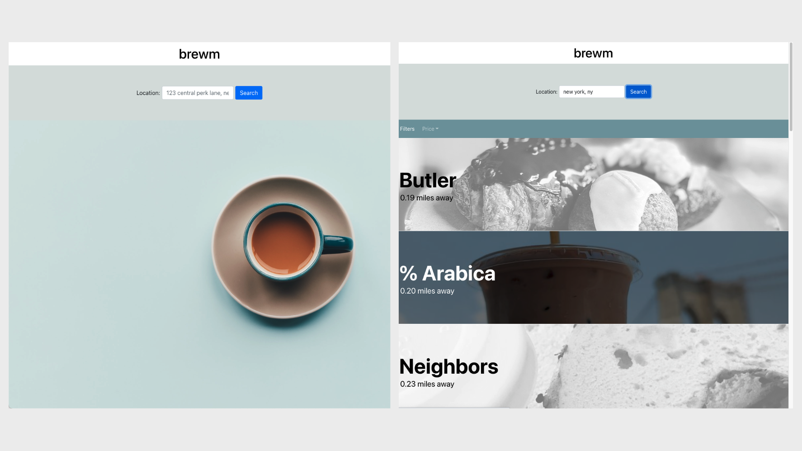

# Brewm

## ☕️ Project Description

Brewm helps users find nearby spaces to get their caffeine fix as they work and study. Based on the entered location, the app will display a list of places categorized as cafes or spots serving coffee or tea. These results are conveniently sorted by distance and can be filtered by price. Each cafe is linked to its own page of available information, including photos, an address, business hours, and contact information.

Have a look around: https://brewm.netlify.app

P.S. The neat background image of the cup of joe was created by <a href="https://unsplash.com/@anniespratt?utm_source=unsplash&utm_medium=referral&utm_content=creditCopyText">Annie Spratt</a> on <a href="https://unsplash.com/s/photos/coffee-minimal?utm_source=unsplash&utm_medium=referral&utm_content=creditCopyText">Unsplash</a>.

## 👩‍💻 Technologies

- This is a front-end React application that utilizes JSX, CSS, Bootstrap, and React Router.
- Data was fetched from the Yelp Fusion API through a Heroku proxy server, which served as a workaround for CORS errors.

## 🛠 Installation

1.  Sign up for a free Yelp Fusion API key [here](https://www.yelp.com/developers/documentation/v3/get_started).
2.  Fork and clone this project.
    > `git clone https://github.com/your_username/Project-Name.git`
3.  Change into the new directory.
    > `cd-react-cafe-finder`
4.  Install the project dependencies with `npm install` and open the project.
5.  Safely store your API key by adding an `.env.local` file in the project root directory and replacing the file's default text with `REACT_APP_YELP_KEY=YourYelpFusionAPIKey`.
6.  Run your server with `npm run start` and start brewin' up a coding storm!

## 🤝 Contribution

I am all about <strong>tea</strong>mwork and constant im<strong>brew</strong>vement. (Too far?) If you have any suggestions, submit an issue or create a pull request! Here are steps to the latter:

1. Fork and clone this project.
2. Create a separate development branch.
   > `git checkout -b your_initials/feature_<feature_description>` or `git checkout -b your_initials/bug_<bug_description>`
3. Commit your changes.
   > `git commit -m "Your brilliant addition"`
4. Push to the branch.
   > `git push origin your_development_branch_name`
5. Open a pull request on GitHub.

##

✨ Thank you so much for your interest in Brewm! ✨
